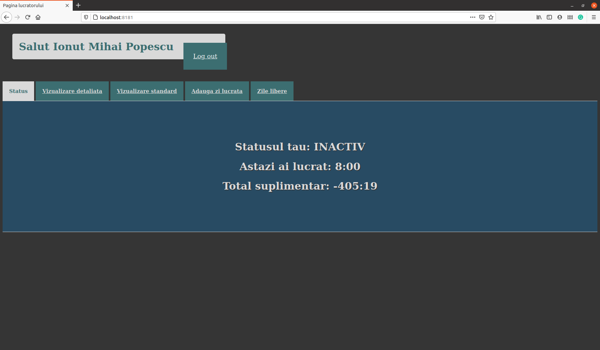
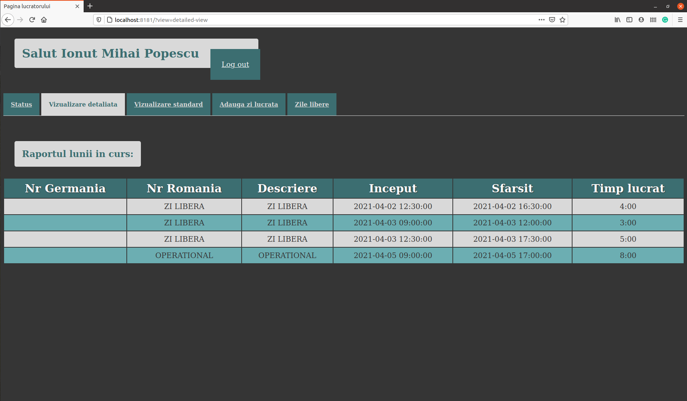
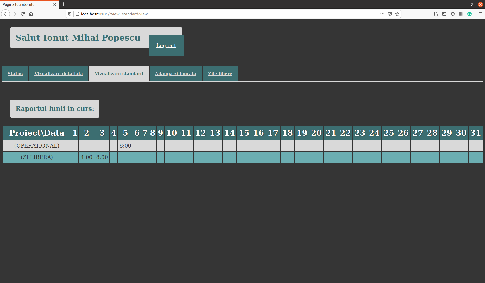
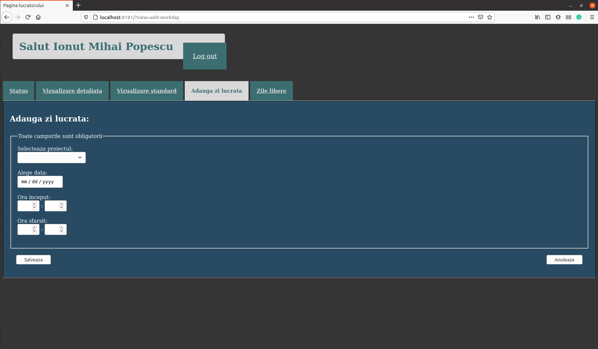
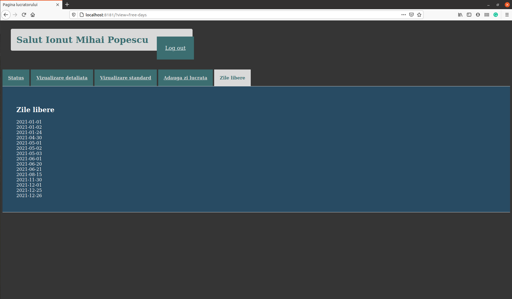

# Eccel_C1
Time keeper for workers in a company using Eccel C1 rfid reader

<h1>The server should only be used in local network !!!! <h1>

<h1>Some screenshots</h1>

For any questions email me at: justmaryo@gmail.com
